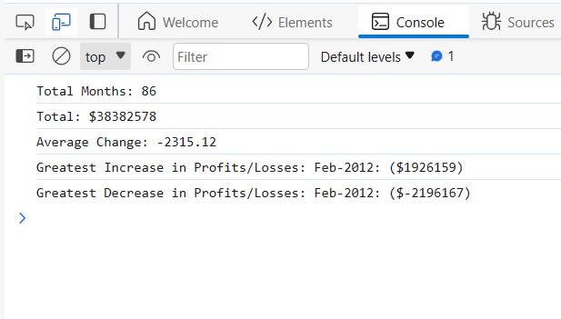

## Console-Finances
Console Finances
## Description

This project aims to analyze the financial records of a company. This is done using Javascript to fetch the records in the finances array inside the index.js file. We are expected to draw up the below details from the above mentioned finances array:

Financial Analysis 
----------------
Total Months: 86
Total: $38382578
Average Change: -2315.12
Greatest Increase in Profits/Losses: Feb-2012 ($1926159)
Greatest Decrease in Profits/Losses: Sep-2013 ($-2196167)

## Link to project

<a href="https://mannyigho.github.io/Console-Finances" target="_blank">

## Installation

Download the Console-Finances folder unto anywhere on your system and you are good to go.

## Usage

TO view the outcome of this project, simply open the index.html file in a browser by double-clicking on it. Right-click anywhere on the webpage and click "Inspect". At the section of the screen that popups below or on the right-hand-side, depending on how the settings on your browser is, click on the "Console" tab to view the result.

    

## Credits

edX Boot Camps LLC

